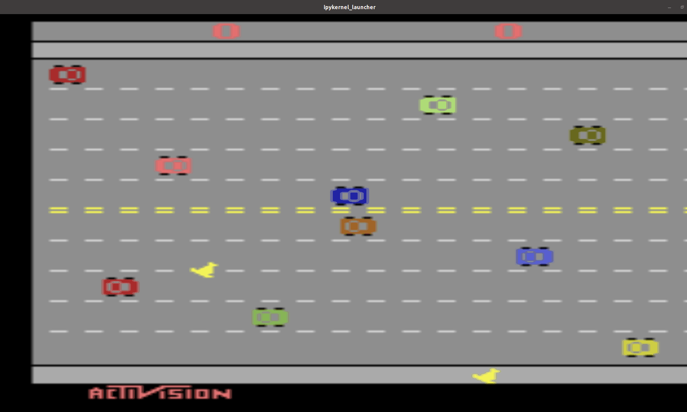
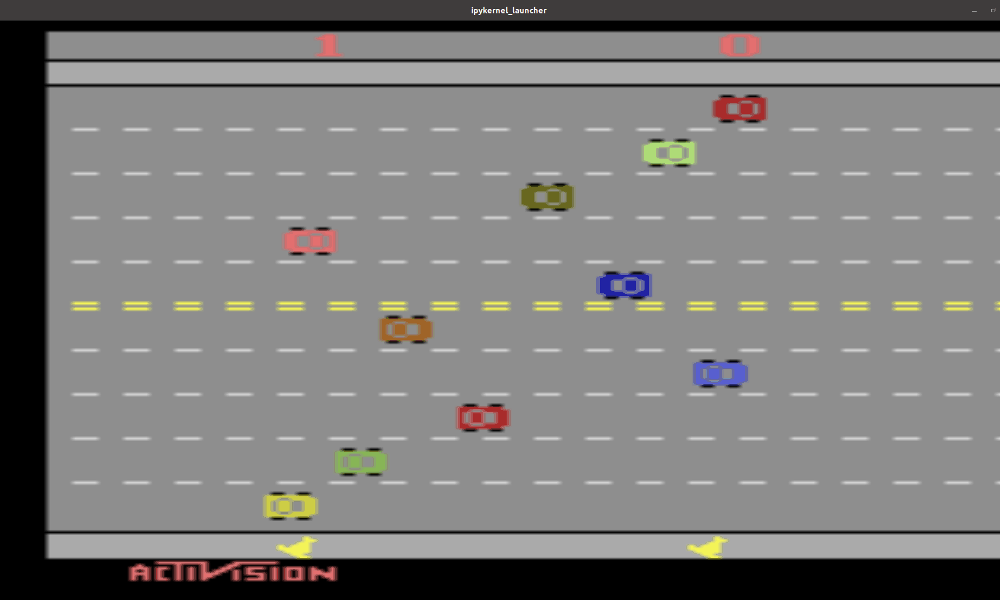

# Planejamento Probabilístico e Aprendizado por Reforço

Este repositório contém o projeto sendo desenvolvido para a disciplina [SIN5021 - Planejamento Probabilístico e Aprendizado por Reforço ](https://uspdigital.usp.br/janus/componente/disciplinasOferecidasInicial.jsf?action=3&sgldis=SIN5021), ministrada no primeiro semestre de 2021 por [Valdinei Freire da Silva](http://lattes.cnpq.br/0813823100105934). Esse trabalho visa aplicar algoritmos de aprendizado por reforço no jogo ~~da galinha~~ Freeway do Atari 2600, assim como a discretização do ambiente para a aplicação de algoritmos ótimos.

* [Notebooks](./Notebooks): Construção do ambiente discreto, algoritmo value iteration, policy iteration, Deep Q-Learning Network. O resultado para o algoritmo Proximal Policy Optimization é proveniente de uma mistura entre as implementações de [ikostrikov](https://github.com/ikostrikov/pytorch-a2c-ppo-acktr-gail) e [AlessandroPomponio](https://github.com/AlessandroPomponio/atari-bowling-ppo);

* [PDF](./PDF): Proposta, entrega parcial do projeto e o artigo final.

Veja o artigo final [aqui](./PDF/artigo_final.pdf)

Agente no início do treinamento e pouco motivado:

Agente após algumas dezenas de milhares de passos e muito motivado:
